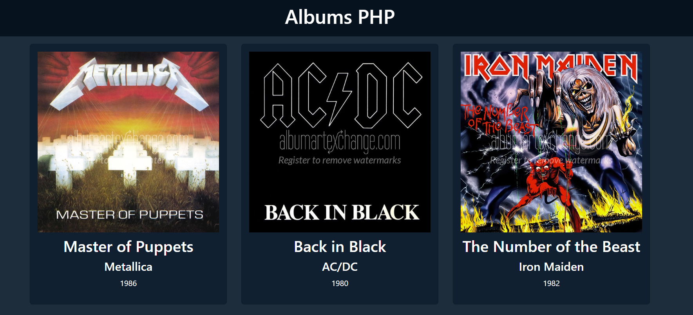

# Displaying Music Album with PHP

This project is a simple web application that displays music albums. It uses Vue.js for the frontend, PHP for the backend, and Axios for making HTTP requests.

## Technologies Used

- **Vue.js**
- **PHP**
- **Axios**

## Features

- Display a list of music albums.
- Click on an album to view more details in a popup overlay.

## How It Works

The PHP backend serves a list of music albums. The Vue.js frontend makes an HTTP GET request to the backend using Axios. The response is an array of album objects, which Vue.js then renders as a list of cards.

When a card is clicked, the selected album is displayed in a popup overlay. The overlay can be closed by clicking anywhere on the screen.

